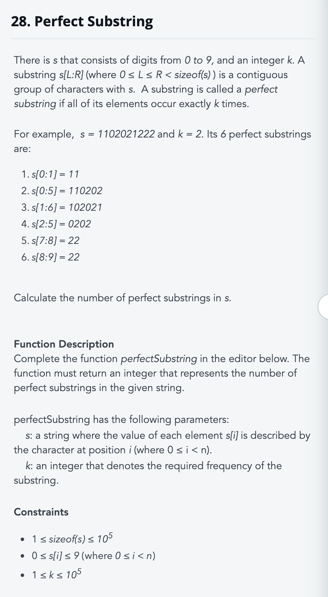

# MemDev Find Perfect Substring



```python
def find_perfect(s, k):
    def isPerfect(st, ed):
        flag = True
        for char in sset:
            occ = indexs[char][ed+1] - indexs[char][st]
            if occ != 0 and occ != k:
                flag = False
                break
        return flag

    sset = set(s)
    indexs = {}
    length = len(s)
    for char in sset:
        indexs[char] = [0 for _ in range(length+1)]
    for i, c in enumerate(s):
        for char in sset:
                indexs[char][i+1] = 1+indexs[char][i] if char == c else indexs[char][i]

    print(indexs)
    res = 0
    for st in range(length):
        for ed in range(st, length):
            if isPerfect(st, ed):
                res += 1
    return res

s = "1221221121"
print(find_perfect(s, 3))
```

